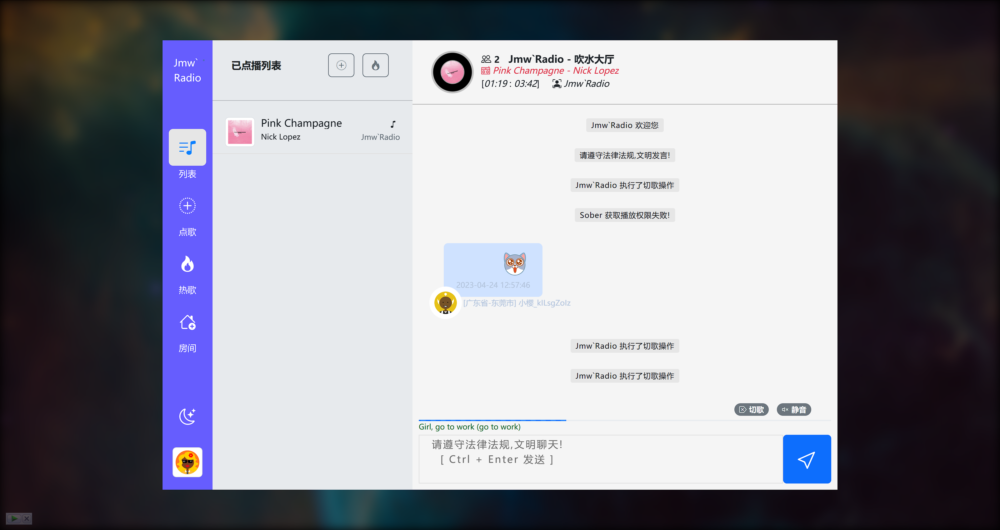
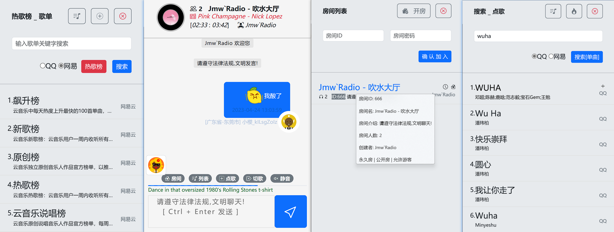

# **Jmw.Radio「音乐聊天室」**

## 这是一个依托于 node.js[Music-Api 服务] + PHP[Websocket通信及逻辑实现] + Redis[数据库] 实现的一个简易音乐聊天室软件,目前已实现功能如下:

**1.系统自助播放随机音乐,用户点歌后优先播放用户点播曲目,点播列表为空时随机播放;**

**2.歌曲单曲搜索&歌单搜索[热歌榜]+点播;**

**3.用户切歌功能[房间5人以上触发同房间用户弹窗切歌确认,可自行更改逻辑]**

**4.PC端与移动端自适应兼容显示**

**5.用户注册登录,邮箱验证码服务**

**6.登录用户自建房[可选是否为密码房及是否允许未登录游客进入]**

**7.聊天敏感词屏蔽为[*]显示,敏感词可自行配置删减[mgz.json]**

**8.房间用户ip地理位置解析显示,将在聊天消息处显示**

**9.游客随机昵称及头像生成,聊天消息表情发送**

**10.~~房间根据用户IP,房主可封禁此IP用户[ban]暂时去除不可用~~**

## 演示地址
> *Jmw`Radio* : http://radio.jmwpower.top/

## 页面效果如下
### PC端主界面

### 移动端主界面

# 开始使用
拉取启动 API 服务

> *QQ-music* : https://github.com/jsososo/QQMusicApi

> *网易云-music* : https://github.com/Binaryify/NeteaseCloudMusicApi

配置 /io/qq.php & /io/wyy.php & 配置 /io/mail/index.php & /js/index.js

配置并启动 redis.php 初始化 数据库信息

windows 点击 start_for_win.bat 启动服务
linux 进入 io 运行 `php run.php start` 启动服务[debug], `php run.php start -d`守护进程

## 同类型项目[借鉴来源]
> *一起听歌吧* : https://github.com/JumpAlang/Jusic-Serve-Houses

> *BBBUG* : https://github.com/HammCn/BBBUG_Frontend

# 免责声明
平台音乐数据来源于第三方网站，仅供学习交流使用，请勿用于商业用途。

# 写在最后
我是个渣渣,大佬勿喷[狗头保命],本地 windows + 云服务器 linux 测试能跑,跑不动请查看报错或者看看上面两个大佬的项目,PHP已经过时了[泪目],且服务可能不稳定,但是胜在简单[本项目对菜鸡友好,大佬路过看见代码别吐血哈哈]!

肯定会存在很多未知的BUG,自己改吧就,不想折腾了,ヾ(￣▽￣)Bye~Bye~

### End
			
